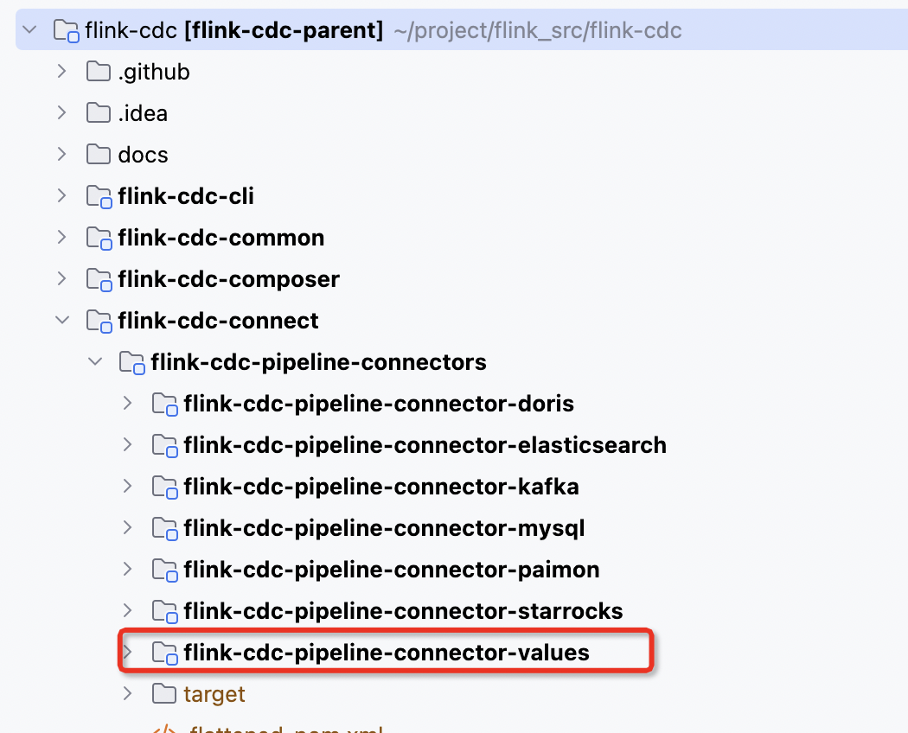
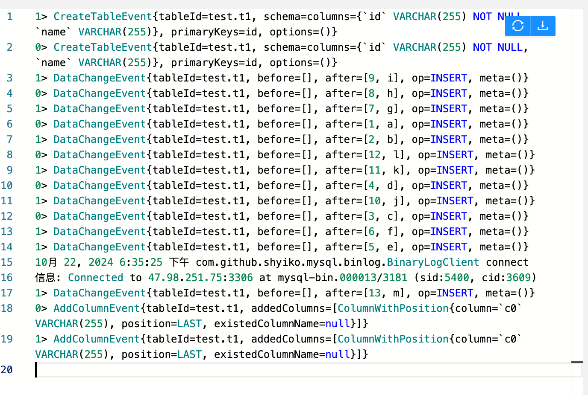
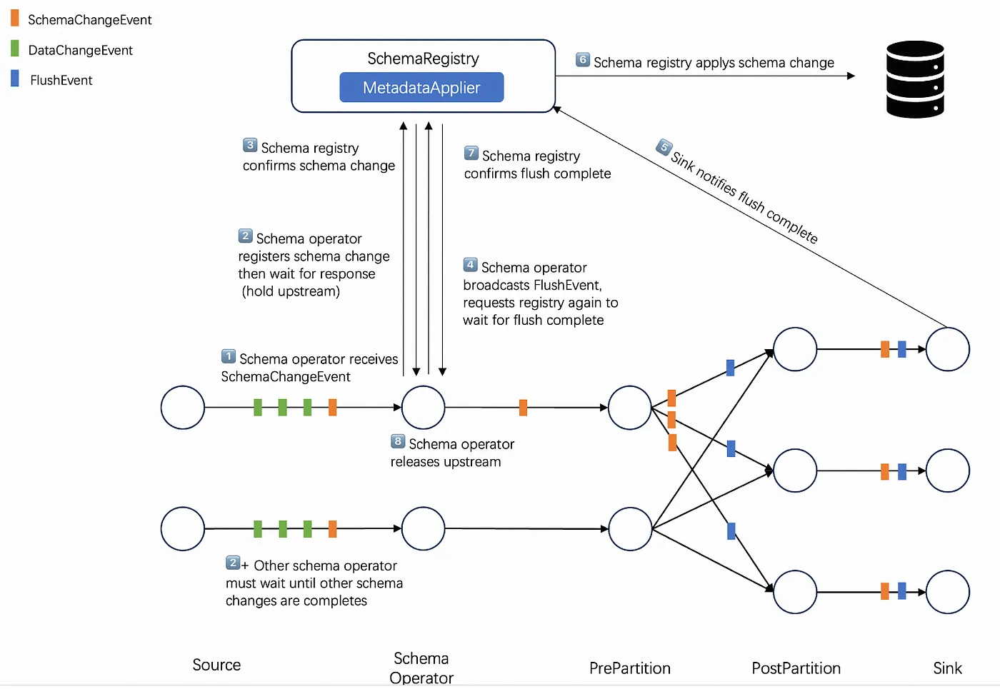
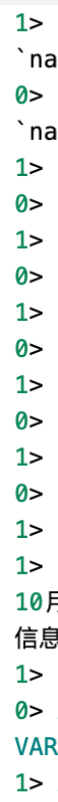
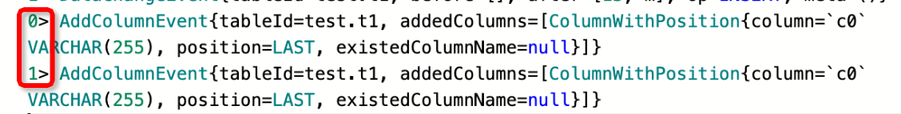
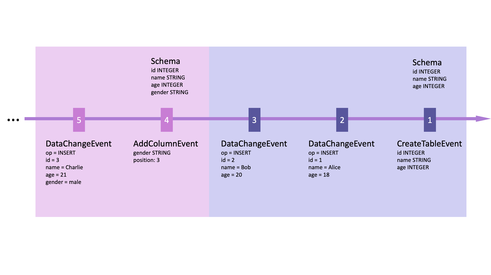

# Flink-cdc Schema Evolution 详解

[flink-cdc-3 glimpse](https://medium.com/@ipolyzos_/a-glimpse-into-flink-cdc-3-0-a985fb5895a5)

3.0 版本变化

* 最大的变化是，可以不用再写代码，而是直接配置一个yaml，就能完成cdc pipeline的构建
* 另外3.0版本中提供了对于schema变更的支持，在上游mysql发生schema变化时，下游的sink可以直接感受到

## 使用pipeline
我们使用一个特殊的sink类型“values”，来观察各种事件的产生，values这个sink会将产生的事件打印在stdout
需要引入包`flink-cdc-pipeline-connector-values-3.3-SNAPSHOT.jar`，可以从flink-cdc工程中编译得到

```
################################################################################
# Description: Sync MySQL all tables to Doris
################################################################################
source:
 type: mysql
 hostname: ${ip}
 port: ${port}
 username: ${username}
 password: ${password}
 tables: ${database}.${table}
 server-id: 5400-5404
 server-time-zone: UTC+8

sink:
  type: values
  name: values Sink

pipeline:
 name: Sync Mysql Database to Values
 parallelism: 2
```
**注意：parallelism > 1 时候一定要开启checkpoint**
### 提交flink-cdc任务
```
./bin/flink-cdc.sh mysql-to-values.yaml
Pipeline has been submitted to cluster.
Job ID: a03966de35dc3141c890250daeac9699
Job Description: Sync Mysql Database to Values
```
### 执行操作，观察flink taskmanager日志
```
mysql> insert into t1 values(13, 'm');
Query OK, 1 row affected (0.01 sec)

mysql> alter table t1 add column c0 varchar(255);
Query OK, 0 rows affected (0.03 sec)
Records: 0  Duplicates: 0  Warnings: 0
```

```
1> CreateTableEvent{tableId=test.t1, schema=columns={`id` VARCHAR(255) NOT NULL,`name` VARCHAR(255)}, primaryKeys=id, options=()}
0> CreateTableEvent{tableId=test.t1, schema=columns={`id` VARCHAR(255) NOT NULL,`name` VARCHAR(255)}, primaryKeys=id, options=()}
1> DataChangeEvent{tableId=test.t1, before=[], after=[9, i], op=INSERT, meta=()}
0> DataChangeEvent{tableId=test.t1, before=[], after=[8, h], op=INSERT, meta=()}
1> DataChangeEvent{tableId=test.t1, before=[], after=[7, g], op=INSERT, meta=()}
0> DataChangeEvent{tableId=test.t1, before=[], after=[1, a], op=INSERT, meta=()}
1> DataChangeEvent{tableId=test.t1, before=[], after=[2, b], op=INSERT, meta=()}
0> DataChangeEvent{tableId=test.t1, before=[], after=[12, l], op=INSERT, meta=()}
1> DataChangeEvent{tableId=test.t1, before=[], after=[11, k], op=INSERT, meta=()}
0> DataChangeEvent{tableId=test.t1, before=[], after=[4, d], op=INSERT, meta=()}
1> DataChangeEvent{tableId=test.t1, before=[], after=[10, j], op=INSERT, meta=()}
0> DataChangeEvent{tableId=test.t1, before=[], after=[3, c], op=INSERT, meta=()}
1> DataChangeEvent{tableId=test.t1, before=[], after=[6, f], op=INSERT, meta=()}
1> DataChangeEvent{tableId=test.t1, before=[], after=[5, e], op=INSERT, meta=()}
10月 22, 2024 6:35:25 下午 com.github.shyiko.mysql.binlog.BinaryLogClient connect
信息: Connected to 47.98.251.75:3306 at mysql-bin.000013/3181 (sid:5400, cid:3609)
1> DataChangeEvent{tableId=test.t1, before=[], after=[13, m], op=INSERT, meta=()}
0> AddColumnEvent{tableId=test.t1, addedColumns=[ColumnWithPosition{column=`c0` VARCHAR(255), position=LAST, existedColumnName=null}]}
1> AddColumnEvent{tableId=test.t1, addedColumns=[ColumnWithPosition{column=`c0` VARCHAR(255), position=LAST, existedColumnName=null}]}
```





### 日志解析
注意看左侧的 ">"

<div align=center>
	
</div>

由于yaml中设置的并发度是2，所有可以看到日志中有两个任务在打印

注意CreateTableEvent和AddColumnEvent这样的关于schema改变的事件会出现在两个并发中，而一个DataChangeEvent事件只会出现在单独一个并发中


flink-cdc 官方文档中描述: schema相关event与DataChangeEvent之间有如下的顺序保证
```
a CreateTableEvent must be emitted before any DataChangeEvent if a table is new to the framework, 
and SchemaChangeEvent must be emitted before any DataChangeEvent if the schema of a table is changed. 
```
见[understand-flink-cdc-api](https://nightlies.apache.org/flink/flink-cdc-docs-release-3.2/docs/developer-guide/understand-flink-cdc-api/)
