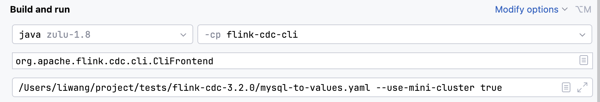
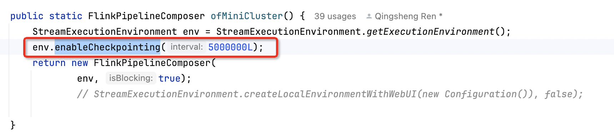
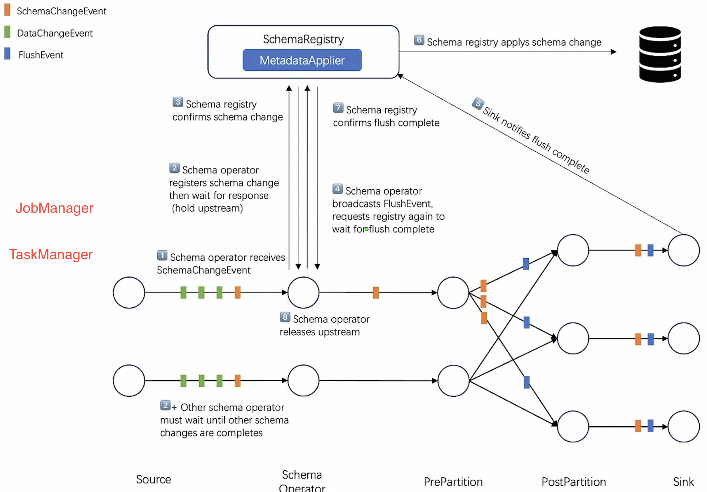
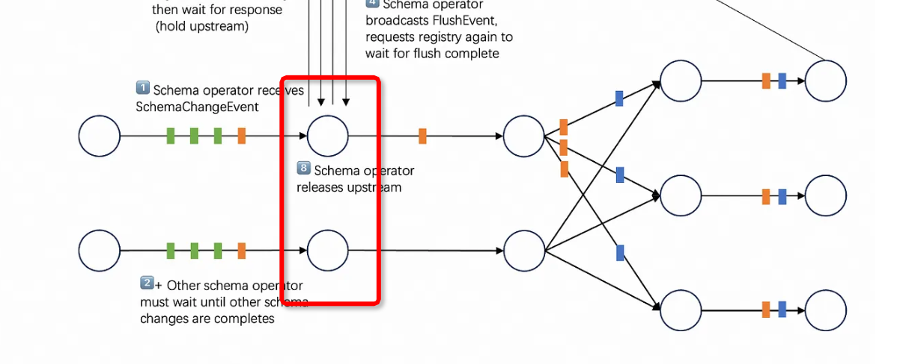
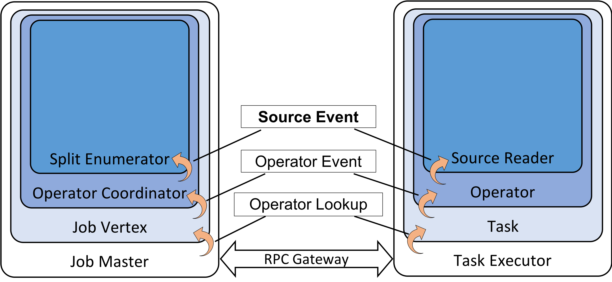

# Flink-cdc Schema Evolution 详解

### glimpse
[flink-cdc-3 glimpse](https://medium.com/@ipolyzos_/a-glimpse-into-flink-cdc-3-0-a985fb5895a5)

### 源码基于
```
~/project/flink_src/flink-cdc master !4 ❯ git remote -v
origin  https://github.com/apache/flink-cdc.git (fetch)
origin  https://github.com/apache/flink-cdc.git (push)
~/project/flink_src/flink-cdc master !4 ❯ git rev-parse HEAD
a5b666a3254b87b44b9a3843a4d001793e86552c
```
```
<revision>3.3-SNAPSHOT</revision>
```

### flink-cdc 3.0 重要特性

* 通过yaml文件定义pipeline
* 能够感知schema变更

## pipeline demo

我们使用一个特殊的sink类型“values”来观察各种事件的产生

values是专门为调试编写的一个sink，会将产生的事件打印在stdout

需要引入包`flink-cdc-pipeline-connector-values-3.3-SNAPSHOT.jar`，可以从flink-cdc工程中编译`flink-cdc-pipeline-connector-values`得到

### pipeline yaml
```
################################################################################
# Description: Sync MySQL all tables to Doris
################################################################################
source:
 type: mysql
 hostname: ${ip}
 port: ${port}
 username: ${username}
 password: ${password}
 tables: ${database}.${table}
 server-id: 5400-5404
 server-time-zone: UTC+8

sink:
  type: values
  name: values Sink

pipeline:
 name: Sync Mysql Database to Values
 parallelism: 2
```
**注意：parallelism > 1 时候一定要在flink中开启checkpoint**
1. 这是flink-cdc的已知bug，尚未解决 [bug链接](https://issues.apache.org/jira/browse/FLINK-34792?jql=project%20%3D%20FLINK%20AND%20issuetype%20%3D%20Bug%20AND%20text%20~%20%22flink-cdc%20checkpoint%22%20ORDER%20BY%20issuetype%20DESC%2C%20priority%20ASC%2C%20updated%20DESC)
2. 如果想要使用flink-cdc源码调试，需要开启 --use-mini-cluster true

3. 并且修改FlinkPipelineComposer的ofMiniCluster方法，手动设置enableCheckpointing

### 提交flink-cdc任务
```
./bin/flink-cdc.sh mysql-to-values.yaml
Pipeline has been submitted to cluster.
Job ID: a03966de35dc3141c890250daeac9699
Job Description: Sync Mysql Database to Values
```
### 在mysql中执行变更操作，观察flink taskmanager日志
```
mysql> insert into t1 values(13, 'm');
Query OK, 1 row affected (0.01 sec)

mysql> alter table t1 add column c0 varchar(255);
Query OK, 0 rows affected (0.03 sec)
Records: 0  Duplicates: 0  Warnings: 0
```

### flink日志


### 日志解析
注意看左侧的 ">"

<div align=center>
	
</div>

由于yaml中设置的并发度是2，所有可以看到日志中有两个任务在打印

注意CreateTableEvent和AddColumnEvent这样的关于schema改变的事件会出现在两个并发中，而一个DataChangeEvent事件只会出现在单独一个并发中


flink-cdc 官方文档中描述: schema相关event与DataChangeEvent之间有如下的顺序保证
```
a CreateTableEvent must be emitted before any DataChangeEvent if a table is new to the framework, 
and SchemaChangeEvent must be emitted before any DataChangeEvent if the schema of a table is changed. 
This requirement makes sure that the framework has been aware of the schema before processing any data changes.
```
见[understand-flink-cdc-api](https://nightlies.apache.org/flink/flink-cdc-docs-release-3.2/docs/developer-guide/understand-flink-cdc-api/)


## schema evolution 实现原理
### 整体视角

SchemaRegistry运行在JobManager中，继承Coordinator与SchemaOperator交互，负责协调不同流水线中收到schema变更event后的同步

### 从yaml到pipeline的转化
* 入口`flink-cdc.sh`
```
exec "$JAVA_RUN" -classpath "$CLASSPATH" "${LOG_SETTINGS[@]}" org.apache.flink.cdc.cli.CliFrontend "$@"
```
* 入口类 `CliFrontend` 在 `CliFrontend.java`
```
main 调用
  createExecutor 调用
    new CliExecutor 其中 pipelineDefPath 是yaml文件的路径
```
* `CliExecutor.java`
```
1. 通过 YamlPipelineDefinitionParser 将 pipelineDefPath parse为pipelineDef
2. PipelineComposer 通过pipelineDef的定义调用flink的api构建流水线
```
* `FlinkPipelineComposer.java`
```
// Build Source Operator
        DataSourceTranslator sourceTranslator = new DataSourceTranslator();
        DataStream<Event> stream =
                sourceTranslator.translate(
                        pipelineDef.getSource(), env, pipelineDef.getConfig(), parallelism);

...

// Schema operator
        SchemaOperatorTranslator schemaOperatorTranslator =
                new SchemaOperatorTranslator(
                        schemaChangeBehavior,
                        pipelineDef.getConfig().get(PipelineOptions.PIPELINE_SCHEMA_OPERATOR_UID),
                        pipelineDef
                                .getConfig()
                                .get(PipelineOptions.PIPELINE_SCHEMA_OPERATOR_RPC_TIMEOUT));
        OperatorIDGenerator schemaOperatorIDGenerator =
                new OperatorIDGenerator(schemaOperatorTranslator.getSchemaOperatorUid());

...

// Build DataSink in advance as schema operator requires MetadataApplier
        DataSinkTranslator sinkTranslator = new DataSinkTranslator();
        DataSink dataSink =
                sinkTranslator.createDataSink(pipelineDef.getSink(), pipelineDef.getConfig(), env);

        stream =
                schemaOperatorTranslator.translate(
                        stream,
                        parallelism,
                        dataSink.getMetadataApplier()
                                .setAcceptedSchemaEvolutionTypes(
                                        pipelineDef.getSink().getIncludedSchemaEvolutionTypes()),
                        pipelineDef.getRoute());
```
这里可以看到从yaml的描述到stream的转化

`stream` 关联-> `当前 env` 关联-> `FlinkPipelineExecution`
最终通过FlinkPipelineExecution.execute()调用用到env.executeAsync()

这里处理用户描述的source和sink节点，flink-cdc还自动插入了一个SchemaOperator节点


#### schema event的流动

SchemaOperator与sink绑定，这里绑定关系到之后的几个操作
1. 定义一个sink的时候要提供MetadataApplier，运行在JobManager（上方），通过Rpc与SchemaOperator交互
```
        schemaOperatorTranslator.translate(
                        ...
                        dataSink.getMetadataApplier()
                                ...);
```
2. 所有的event都要经过SchemaOperator，SchemaOperator对于SchemaChangeEvent特殊处理 `SchemaOperator.java`
```
public void processElement(StreamRecord<Event> streamRecord)
            throws InterruptedException, TimeoutException, ExecutionException {
        Event event = streamRecord.getValue();
        if (event instanceof SchemaChangeEvent) {
            processSchemaChangeEvents((SchemaChangeEvent) event);
        } else if (event instanceof DataChangeEvent) {
           ...
    }
```
最终调用到handleSchemaChangeEvent
```
private void handleSchemaChangeEvent(TableId tableId, SchemaChangeEvent schemaChangeEvent)
            throws InterruptedException, TimeoutException {
           ...
        // The request will block if another schema change event is being handled
        SchemaChangeResponse response = requestSchemaChange(tableId, schemaChangeEvent);
        if (response.isAccepted()) {
            LOG.info("{}> Sending the FlushEvent for table {}.", subTaskId, tableId);
            output.collect(new StreamRecord<>(new FlushEvent(tableId)));
            ...
            // The request will block until flushing finished in each sink writer
            SchemaChangeResultResponse schemaEvolveResponse = requestSchemaChangeResult();
    }
```
回想一下刚才在mysql中alter table add column的场景，每一个并发度都有一个AddColumnEvent，都会去调用
requestSchemaChange，向Coordinator发送SchemaChangeRequest
```
private SchemaChangeResponse requestSchemaChange(
            TableId tableId, SchemaChangeEvent schemaChangeEvent)
            throws InterruptedException, TimeoutException {
       ...
        while (true) {
            SchemaChangeResponse response =
                    sendRequestToCoordinator(
                            new SchemaChangeRequest(tableId, schemaChangeEvent, subTaskId));
           ...
        }
    }
```
在`SchemaRegistry.java`响应请求
```
 public CompletableFuture<CoordinationResponse> handleCoordinationRequest(
            CoordinationRequest request) {
        ...
      
                        if (request instanceof SchemaChangeRequest) {
                            SchemaChangeRequest schemaChangeRequest = (SchemaChangeRequest) request;
                            requestHandler.handleSchemaChangeRequest(
                                    schemaChangeRequest, responseFuture);
                        } else if (request instanceof SchemaChangeResultRequest) {
                            requestHandler.getSchemaChangeResult(responseFuture);
                        }
                           ...
    }
```
这时两个请求只有一个会被处理，另外一个会被认为是duplicate

处理的步骤如下
* 发起schema变更请求requestSchemaChange
* 如果被Coordinator Accept，执行`output.collect(new StreamRecord<>(new FlushEvent(tableId)));`
        
  * flushEvent在`PrePartitionOperator.java`被广播给下游所有的sink

        
        ```
        public void processElement(StreamRecord<Event> element) throws Exception {
              ...
              if (event instanceof FlushEvent) {
                // Broadcast FlushEvent
                broadcastEvent(event);
              }
              ...
        }
        ```

  * flushEvent在sink中会触发当前sink flush所有缓存的事件，之后通知Coordinator完成`DataSinkFunctionOperator.java`

        ```
        private void handleFlushEvent(FlushEvent event) throws Exception {
                userFunction.finish();
                schemaEvolutionClient.notifyFlushSuccess(
                        getRuntimeContext().getIndexOfThisSubtask(), event.getTableId());
        }
        ```

* hang在requestSchemaChangeResult，等待MetadataApplier变更下游数据库schema（比如Doris），天然hang住了上游消息
* 如果不是第一个requestSchemaChange（相同请求已经在被处理），会hang在requestSchemaChange，也天然hang住上游消息，在Coordinator(SchemaRegistry/MetaAppier)处理好之后会走duplicate分支，只打印日志`"{}> Schema change event {} has been handled in another subTask already."`
* 下游sink在处理完flush之后会触发notifyFlushSuccess，`SchemaRegistry.java` SchemaRegistry会调用`handleEventFromOperator`响应，最终调用到`SchemaRegistryRequestHandler.java`中的`applySchemaChange`, 调用对应sink的metadataApplier
        ```
        metadataApplier.applySchemaChange(changeEvent);
        ```
* 上面步骤完成之后第一个hang住的requestSchemaChange会返回
#### MetadataApplier中干了什么
拿Doris举例, 直接去修改后端的列了，这时修改是安全的，因为上游的mysql修改schema之后产生的消息都被hang住，修改schema之前的消息都已经被各个sink flush消费完

`DorisMetadataApplier.java`
```
 public void applySchemaChange(SchemaChangeEvent event) {
        SchemaChangeEventVisitor.<Void, SchemaEvolveException>visit(
                event,
                addColumnEvent -> {
                    applyAddColumnEvent(addColumnEvent);
                    return null;
                },
                alterColumnTypeEvent -> {
                    applyAlterColumnTypeEvent(alterColumnTypeEvent);
                    return null;
                },
                createTableEvent -> {
                    applyCreateTableEvent(createTableEvent);
                    return null;
                },
                dropColumnEvent -> {
                    applyDropColumnEvent(dropColumnEvent);
                    return null;
                },
                ...
```

### glimpse 中没有说清楚的点
1. schema变更消息会在每个并发度的源头都会产生吗？

~~回答：是的，只有这样SchemaOperator才有机会正确的hang住所有的并发度，并等待SchemaRegistry（MetadataApplier）的响应~~

更正回答：不是的，在values sink的stdout输出中我们可以看到对于schema变更消息，有两份输出，这时因为，在schemaOperator之后紧跟了一个PrePartition算子
        
其中的processElement 实现如下 在PrePartitionOperator.java
        
```
public void processElement(StreamRecord<Event> element) throws Exception {
        Event event = element.getValue();
        if (event instanceof SchemaChangeEvent) {
        // Update hash function
        TableId tableId = ((SchemaChangeEvent) event).tableId();
        cachedHashFunctions.put(tableId, recreateHashFunction(tableId));
        // Broadcast SchemaChangeEvent
        broadcastEvent(event);
        } else if (event instanceof FlushEvent) {
        // Broadcast FlushEvent
        broadcastEvent(event);
        } else if (event instanceof DataChangeEvent) {
        // Partition DataChangeEvent by table ID and primary keys
        partitionBy(((DataChangeEvent) event));
        }
}
```

可以看到对于SchemaChangeEvent和FlushEvent是向下游广播的，所以values sink中才会有多份打印

2. 接上一个问题，如果多个source都有可能产生data change event，而一次schema变更只在一个source上产生，是如何保证正确性的呢？

简单想想一个有问题的场景，比如读取的binlog中消息1、2、3是datachange消息，s是schema change消息，发生的时间顺序是1 s 2 3，

但是由于并发度是2，这时有可能在s执行之前，2先执行了，这时就出现了逻辑问题，因为2是依赖变更后的schema， 2不可以先于s执行

```
┌─────────────┐                              ┌───────────────┐
│             │         ┌──┐    ┌──┐  ┌──┐   │               │
│   source1   ├─────────┼ 3┼────┼ s┼──┼ 1│──►│ schemaOprator │
│             │         └──┘    └──┘  └──┘   │               │
└─────────────┘                              └───────────────┘
                                                              
                                                              
┌─────────────┐                              ┌───────────────┐
│             │               ┌───┐          │               │
│   source2   ├───────────────┼  2┼─────────►│ schemaOprator │
│             │               └───┘          │               │
└─────────────┘                              └───────────────┘
```
针对这个问题，flink-cdc的做法是，binlogsplit只有一个subTask在读取，可以看MySqlSourceEnumerator->MySqlSnapshotSplitAssigner->MySqlHybridSplitAssigner#getNext

```
@Override
    public Optional<MySqlSplit> getNext() {
        if (AssignerStatus.isNewlyAddedAssigningSnapshotFinished(getAssignerStatus())) {
            // do not assign split until the adding table process finished
            return Optional.empty();
        }
        if (snapshotSplitAssigner.noMoreSplits()) {
            // binlog split assigning
            if (isBinlogSplitAssigned) {
                // no more splits for the assigner
                return Optional.empty();
            } else if (AssignerStatus.isInitialAssigningFinished(
                    snapshotSplitAssigner.getAssignerStatus())) {
                // we need to wait snapshot-assigner to be finished before
                // assigning the binlog split. Otherwise, records emitted from binlog split
                // might be out-of-order in terms of same primary key with snapshot splits.
                isBinlogSplitAssigned = true;
                return Optional.of(createBinlogSplit());
            } else if (AssignerStatus.isNewlyAddedAssigningFinished(
                    snapshotSplitAssigner.getAssignerStatus())) {
                // do not need to create binlog, but send event to wake up the binlog reader
                isBinlogSplitAssigned = true;
                return Optional.empty();
            } else {
                // binlog split is not ready by now
                return Optional.empty();
            }
        } else {
            // snapshot assigner still have remaining splits, assign split from it
            return snapshotSplitAssigner.getNext();
        }
    }
```

注意这里面isBinlogSplitAssigned如果被设置一次了，就不会再调用createBinlogSplit，所以在flink没有异常重启的情况下，createBinlogSplit只会被调用一次

也就是说，只有一个subTask能拿到binlogsplit

这很合理，因为在执行mysql语句`show master status`的时候，也只会返回一个活跃的binglog信息，作为消费者，只有单线程串行读才是正确行为

3. 上面说的是通过binlog读取增量数据的逻辑，对于存量的大量数据，多source并发有意义吗？

回答：有意义。

首先需要明确source的实现架构 [FLIP-27](https://cwiki.apache.org/confluence/display/FLINK/FLIP-27%3A+Refactor+Source+Interface)

在`Top level public interfaces`这一小节描述了关键接口的含义，我们挑选出最重要的三个

```
Source - A factory style class that helps create SplitEnumerator and SourceReader at runtime.
...
SplitEnumerator - Discover the splits and assign them to the SourceReaders
...
SourceReader - Read the records from the splits assigned by the SplitEnumerator.
```


可以看到，SplitEnumerator运行在JobManager中，负责给reader分配split，这里面就包括snapShotSplit和binlogSplit

可以想象，在任务刚启动的时候，要拉取mysql的存量数据，这时是可以通过分隔主键区间，在多个任务上并行进行的

我们可以看MySqlSourceEnumerator的 splitAssigner，默认情况下是一个MySqlHybridSplitAssigner

一个assigner负责提供getNext方法，当reader需要split的时候会请求enumerator，enumerator会调用assigner的getNext方法枚举下一个split

上面看到在binlog的场景下只会枚举到1个split，第二个reader再来请求时就会返回空

这里hybrid的含义就是这个assigner工作在两种模式下，也就是两个阶段

1. 存量数据读取阶段
2. 增量数据读取阶段

在存量读取阶段，实际上是用了MySqlSnapshotSplitAssigner的能力

在MySqlSnapshotSplitAssigner.java的开头有一段描述

```
/**
 * A {@link MySqlSplitAssigner} that splits tables into small chunk splits based on primary key
 * range and chunk size.
 *
 * @see MySqlSourceOptions#SCAN_INCREMENTAL_SNAPSHOT_CHUNK_SIZE
 */
```

这个assigner会根据 primary key 切分出多个split，可以同时被多个reader执行

当存量数据读取完成，会进入到增量读取阶段，这时候只有一个source能够工作，其他的source实际上没有数据输入

阿里云上针对这个场景可以做到动态缩容[关于MySQL CDC源表](https://help.aliyun.com/zh/flink/developer-reference/mysql-connector/#section-mxk-9ip-5kv)

```
全量阶段积累了大量历史数据，为了提高读取效率，通常采用并发的方式读取历史数据。而在Binlog增量阶段，因为Binlog数据量少且为了保证全局有序，通常只需要单并发读取。全量阶段和增量阶段对资源的不同需求，可以通过自动调优功能自动帮您实现性能和资源的平衡。

自动调优会监控MySQL CDC Source的每个task的流量。当进入Binlog阶段，如果只有一个task在负责Binlog读取，其他task均空闲时，自动调优便会自动缩小Source的CU数和并发。开启自动调优只需要在作业运维页面，将自动调优的模式设置为Active模式。
```

另外可以开启多线程加速binlog解析，但是最终还是要存放到一个穿行队列中

```
MySQL连接器作为源表或数据摄入数据源使用时，在增量阶段会解析Binlog文件生成各种变更消息，Binlog文件使用二进制记录着所有表的变更，可以通过以下方式加速Binlog文件解析。

开启并行解析和解析过滤配置

使用配置项scan.only.deserialize.captured.tables.changelog.enabled：仅对指定表的变更事件进行解析。

使用配置项scan.only.deserialize.captured.tables.changelog.enabled：采用多线程对Binlog文件进行解析、并按顺序投放到消费队列。

优化Debezium参数

 
debezium.max.queue.size: 162580
debezium.max.batch.size: 40960
debezium.poll.interval.ms: 50
debezium.max.queue.size：阻塞队列可以容纳的记录的最大数量。当Debezium从数据库读取事件流时，它会在将事件写入下游之前将它们放入阻塞队列。默认值为8192。

debezium.max.batch.size：该连接器每次迭代处理的事件条数最大值。默认值为2048。

debezium.poll.interval.ms：连接器应该在请求新的变更事件前等待多少毫秒。默认值为1000毫秒，即1秒。
```

另外在flink-cdc代码中也能看到，如果开启相关配置，会在进入binlog模式时关闭不需要的reader

在MySqlSourceEnumerator.java MySqlSourceEnumerator#assignSplits中

```
if (shouldCloseIdleReader(nextAwaiting)) {
        // close idle readers when snapshot phase finished.
        context.signalNoMoreSplits(nextAwaiting);
        awaitingReader.remove();
        LOG.info("Close idle reader of subtask {}", nextAwaiting);
        continue;
}
```

### 总结
flink-cdc 3.0 通过加入了SchemaOperator和MetadataApplier，监控链路上所有消息，当发生schema变更时，同步上下游

1. hang住上游
2. flush下游
3. 修改下游schema
4. 恢复运行

这样实现了自动schema变更

多并发会加速存量数据的同步，增量数据的读取还是只能通过一个并发