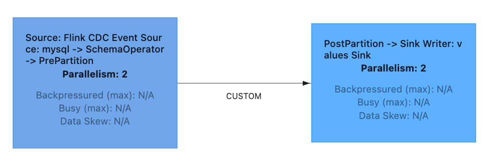
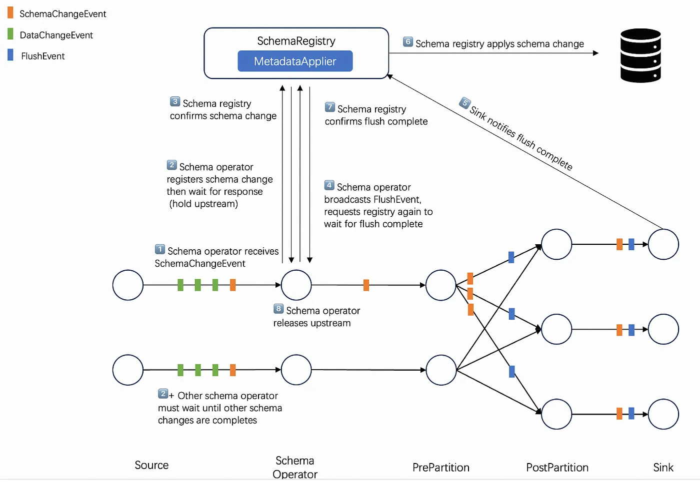
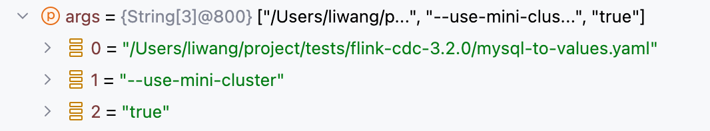
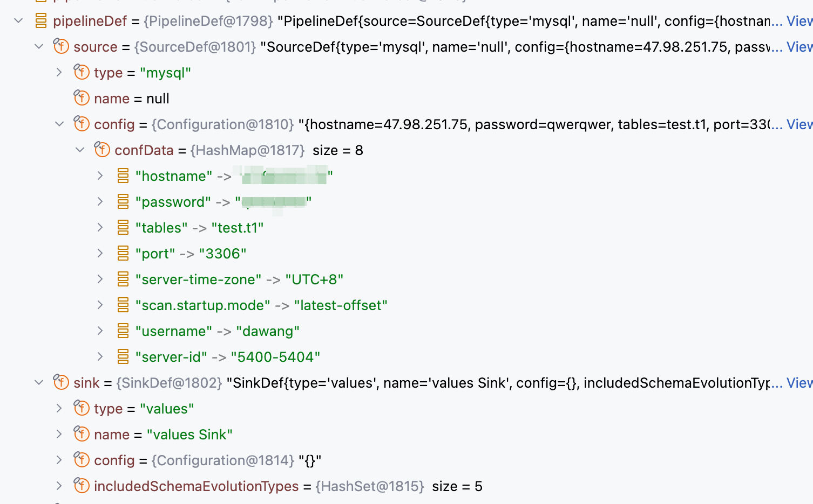

# flink-pipeline-composer 详解

## 背景

在flink-cdc 3.0中引入了pipeline机制，提供了除Datastream api/flink sql以外的一种方式定义flink 任务

通过提供一个yaml文件，描述source sink transform等主要信息

由FlinkPipelineComposer解析，自动调用DataStream api进行构建

[官方样例](https://nightlies.apache.org/flink/flink-cdc-docs-master/zh/docs/core-concept/data-pipeline/)

```
 source:
     type: mysql
     hostname: localhost
     port: 3306
     username: root
     password: 123456
     tables: app_db.\.*

   sink:
     type: doris
     fenodes: 127.0.0.1:8030
     username: root
     password: ""

   pipeline:
     name: Sync MySQL Database to Doris
     parallelism: 2
```

目前可以通过source配置的源只有mysql 和 values

values是调试用的，所以可以说当前这个功能是专门为“mysql同步数据到各个sink”的场景使用的

目前可以使用的sink有

1. doris
2. elasticsearch
3. kafka
4. paimon
5. starrocks
6. values


## FlinkPipelineComposer

我们以mysql -> values来观察 FlinkPipelineComposer 是如何通过读取yaml文件的定义来构建DataStream的

values会将mysql产生的cdc消息打印到stdout上

```
################################################################################
# Description: Sync MySQL all tables to Doris
################################################################################
source:
 type: mysql
 hostname: x.x.x.x
 port: 3306
 username: username
 password: password
 tables: test.t1
 server-id: 5400-5404
 server-time-zone: UTC+8

sink:
  type: values
  name: values Sink

pipeline:
 name: Sync Mysql Database to Values
 parallelism: 2
```

首先来观察一下这个任务提交到flink集群后具体的链路构成



结合官方给出的架构



可以看出，“一个source，一个sink”的yaml定义，最终会生成5个operator

1. Souce: Flink CDC Event Source: mysql
2. SchemaOperator
3. PrePartition

-------------- shuffle --------------

4. PostPartion
5. Sink Writer: values Sink

### Souce: Flink CDC Event Source: mysql

负责

1. 创建枚举器
2. 创建reader
3. 枚举split分发给reader
4. reader读取数据生成事件

### SchemaOperator
负责和JobMaster上的coodinator沟通，执行schema evolution 相关逻辑，见[Flink CDC Schema Evolution 详解](https://github.com/freelw/linux_learn_diary/tree/master/flink-cdc-learn)

### PrePartition

负责

1. 广播FlushEvent
2. 广播SchemaChangeEvent
3. shuffle普通消息到下游

### PostPartion

### Sink Writer: values Sink

写入下游，values sink当前到实现是打印到stdout

## 源码解析

接下来分析，FlinkPipelineComposer 读取 yaml 构造DataStream的细节

### CliFrontend#main

CliFrontend.java:54

args



createExecutor 创建 executor CliFrontend.java:76

调用CliExecutor#run CliExecutor.java:70

看一下解析得到的pipelineDef



这里已经从yaml文件中解析出了source和sink的配置了

composer.compose 调用compose方法开始使用DataStream api进行构建

FlinkPipelineComposer.java:92 FlinkPipelineComposer#compose

声明了5个translator，其中第一个sourceTranslator会生成`DataStream<Event> stream`，而其他的translator基于这个stream作为input，调用transform方法，放入对应阶段的operator

```
DataSourceTranslator sourceTranslator = new DataSourceTranslator();
...
TransformTranslator transformTranslator = new TransformTranslator();
...
SchemaOperatorTranslator schemaOperatorTranslator =...
...
DataSinkTranslator sinkTranslator = new DataSinkTranslator();
...
PartitioningTranslator partitioningTranslator = new PartitioningTranslator();
...
```

translate的调用顺序如下
```
DataStream<Event> stream =
                sourceTranslator.translate(
                  ...
stream =
                transformTranslator.translatePreTransform(
                  ...
stream =
                transformTranslator.translatePostTransform(
                  ...
stream =
                schemaOperatorTranslator.translate(
                  ...
stream =
                partitioningTranslator.translate(
                  ...
sinkTranslator.translate(
                pipelineDef.getSink(), stream, dataSink, schemaOperatorIDGenerator.generate());

return new FlinkPipelineExecution(env...)
                  ...

```

逐一说明
1. sourceTranslator.translate 通过source名字获取sourceProvider，关联到stream中
  * sourceProvider.getSource ->
    * MysqlSource ->
      * createReader
      * createEnumerator

2. stream = transformTranslator.translatePreTransform 
  ```
  if (transforms.isEmpty()) {
      return input;
  }
  ```
  由于有如上代码，我们的yaml中没有涉及，所以忽略这个transform

3. stream = transformTranslator.translatePostTransform
  * 同上

4. stream = schemaOperatorTranslator.translate
  * 插入一个schemaOperator节点，在收到schemaChangeEvent的时候
    1. 停住当前刘
    2. 上报coodinator
    3. flush下游数据，让sink消耗完已有数据
    4. sink 通知coodinator flush完成
    5. coodinator调用sink注册的MetaApplier完成schema变更，变更完成后通知schemaOperator
    6. schemaOperator重新放通数据

5. stream = partitioningTranslator.translate
  * 构建prePartition postPartition节点

6. sinkTranslator.translate
  * 构建sink节点

7. FlinkPipelineExecution 中的 execute 方法调用 `env.executeAsync(jobName)`

