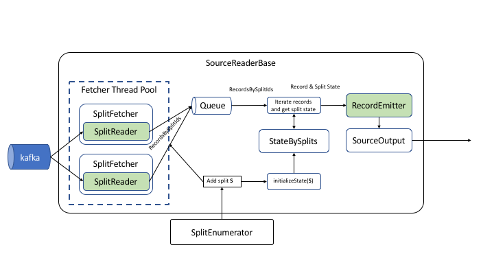

# flink source 详解
[flip-27](https://cwiki.apache.org/confluence/display/FLINK/FLIP-27%3A+Refactor+Source+Interface)


FLIP-27 介绍了新版本Source 接口定义及架构

相比于SourceFunction，新版本的Source更具灵活性，原因是将splits数据获取与真正数据获取逻辑进行了分离



重要组件

Source 作为工厂类
1. createEnumerator
    * 创建 Enumerator
    * Enumerator 响应request split请求, 工作在JobMaster(官方描述如下)

        ```
        Where to run the enumerator
        There was a long discussion about where to run the enumerator which we documented in the appendix. The final approach we took was very similar to option 3 with a few differences. The approach is following.

        Each SplitEnumerator will be encapsulated in one SourceCoordinator. If there are multiple sources, multiple SourceCoordinator will there be. The SourceCoordinators will run in the JobMaster, but not as part of the ExecutionGraph. In this FLIP, we propose to failover the entire execution graph when the SplitEnumerator fails. A finer grained enumerator failover will be proposed in a later FLIP.
        ```

2. createReader
