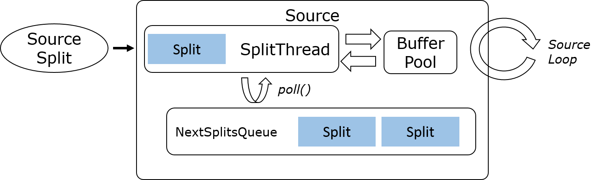
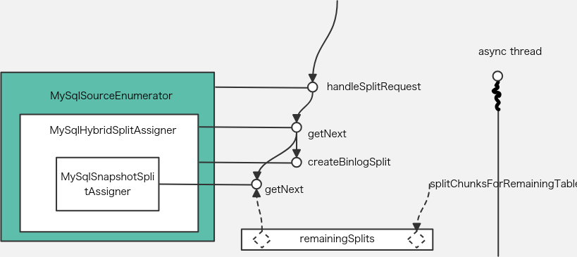
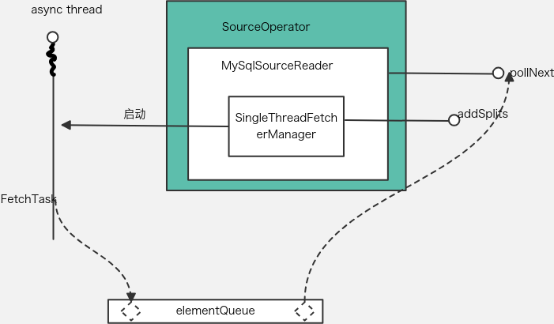

# Flink Source 详解
[flip-27](https://cwiki.apache.org/confluence/display/FLINK/FLIP-27%3A+Refactor+Source+Interface)
FLIP-27 介绍了新版本Source 接口定义及架构

相比于SourceFunction，新版本的Source更具灵活性，原因是将“splits数据获取”与真“正数据获取”逻辑进行了分离


## 重要部件
Source 作为工厂类，会创建以下两个重要部件
1. SplitEnumerator 
    * 通过createEnumerator创建
    * SplitEnumerator 响应request split请求
        * handleSplitRequest
    * 工作在SourceCoordinator (官方描述如下)，可以理解为在JobMaster上运行一个单线程的逻辑，所以需要跟在worker上的reader通过rpc通信

        ```
        Where to run the enumerator
        There was a long discussion about where to run the enumerator which we documented in the appendix. The final approach we took was very similar to option 3 with a few differences. The approach is following.

        Each SplitEnumerator will be encapsulated in one SourceCoordinator. If there are multiple sources, multiple SourceCoordinator will there be. The SourceCoordinators will run in the JobMaster, but not as part of the ExecutionGraph. In this FLIP, we propose to failover the entire execution graph when the SplitEnumerator fails. A finer grained enumerator failover will be proposed in a later FLIP.
        ```

2. SourceReader
    * 通过createReader创建
    * 工作在worker
    * 由于单独实现SourceReader过于复杂，官方抽象了3种比较通用的模型供开发者使用，`MySqlSourceReader`就是继承了`SingleThreadMultiplexSourceReaderBase`
        1. Sequential Single Split (File, database query, most bounded splits)
        2. Multi-split multiplexed (Kafka, Pulsar, Pravega, ...)
        3. Multi-split multi-threaded (Kinesis, ...)
        
        
        
    * 使用了抽象后的类，开发者的关注点集中在实现一个SplitReader
        ```
        public interface SplitReader<E, SplitT extends SourceSplit> {
 
            RecordsWithSplitIds<E> fetch() throws InterruptedException;
        
            void handleSplitsChanges(Queue<SplitsChange<SplitT>> splitsChanges);
        
            void wakeUp();
        }
        ```
        1. fetch 获取数据，这里是包含了split信息的record
        2. 响应split改变
        3. 唤醒

3. RecordEmitter
    1. The RecordsWithSplitIds returned by the SplitReader will be passed to an RecordEmitter one by one.
    2. The RecordEmitter is responsible for the following:
        * Convert the raw record type <E> into the eventual record type <T>
        * Provide an event time timestamp for the record that it processes.
    3. 在 emitRecord 方法中实现

由于通信使用mail风格的rpc（单线程串行），所以响应函数需要保证非阻塞，所以后面可以看到无论enumerator还是reader的最终响应都是在异步线程池中

```
Non-blocking progress methods, to it supports running in an actor/mailbox/dispatcher style operator
```

## MysqlSource 举例

以flink cdc中的MysqlSource来举例分析

1. MysqlSource
    * 通过 createEnumerator 创建 MySqlSourceEnumerator
        * 初始化调用start
            * 调用splitAssigner.open()
                * splitAssigner 是获取/分配split动作的真正实现
                    * 创建异步线程，填充remainingSplits
        * handleSplitRequest 响应空闲worker的请求
            * assignSplits
                * splitAssigner.getNext()
                    * 从 remainingSplits 拿一个可用的split
        * 调用 context.assignSplit 发送 AddSplitEvent
        * MySqlSourceEnumerator 中 splitAssigner 的实现说明
            * splitAssigner 默认实现是 MySqlHybridSplitAssigner
                * hybrid的含义，启动分为两个步骤 1. 读取全量数据 2. 全量数据读取完毕后读取增量数据。将两种模式混合在一起被称为hybird。所以MySqlSnapshotSplitAssigner可以创建两种split
                    1. 通过MySqlSnapshotSplitAssigner创建存量数据的split
                        * 在读取存量数据时通过chunkSplitter切分为多个split，之后分发给多个reader并行读取
                            * chunkSplitter 通过 chunkKey 的范围将存量数据切分
                            * 用户可以手动设置chunkKey，否则使用主key作为chunkKey，切分split
                    2. 通过 createBinlogSplit 创建增量数据的split
                        * 只assign一次binlog的split
                        * 只能分发给一个reader，所以在进入增量模式后flink实际所有并行度上只有一个source有数据
        
    * 通过 createReader 创建 MySqlSourceReader
        * 创建 SingleThreadFetcherManager 传入 elementQueue splitReaderSupplier
            * elementQueue: io线程和主线程公用队列，io线程写，主线程读
            * splitReaderSupplier: split reader的工厂
            * SingleThreadFetcherManager 启动后创建线程池
        * sourceOperator 收到 AddSplitEvent 调用 sourceReader.addSplits 这里 sourceReader 是 MySqlSourceReader
            * readerBase 中会调用 splitFetcherManager.addSplits(splits);
                * 由于使用的是 SingleThreadFetcherManager，所以addSplits中永远看到只同时存在一个fetcher
                    * fetcher 初始化时加入默认任务 FetchTask 构造的时候传入 elementQueue 传入构造好的 splitReader
                    * fetcher addSplits时加入任务 AddSplitsTask
                    * fetcher 启动时调用 startFetcher
                        * 调用 executors.submit(fetcher); 提交到线程池
                        * 线程池中运行 runOnce
                            * FetchTask 调用 splitReader.fetch() 获取records 写入 elementQueue
        * 主线程 SourceReaderBase 中的 pollNext 会被框架调用
            * 调用 getNextFetch
                * elementsQueue.poll() 取得 records
        

## 其他

在Flink CDC 3.0 中

Flink Composer 中使用 WatermarkStrategy.noWatermarks()
```
 return env.fromSource(
                            sourceProvider.getSource(),
                            WatermarkStrategy.noWatermarks(),
                            sourceDef.getName().orElse(generateDefaultSourceName(sourceDef)),
                            new EventTypeInfo())
                    .setParallelism(sourceParallelism);
```

很合理，因为pipeline的定义中不会出现聚合函数 window函数